# 프로젝트명

📢 2025년 1학기 [AIKU](https://github.com/AIKU-Official) 활동으로 진행한 프로젝트입니다
🎉 2025년 1학기 AIKU Conference 열심히상 수상!

## 소개

> **HanCLIP**: A lightweight and efficient cross-lingual vision-language model for Korean, built on top of CLIP


HanCLIP은 대규모 한국어–이미지 쌍 없이도 한국어와 시각 정보 간 의미 정렬을 가능하게 하는 효율적인 비전-언어 모델입니다. **영어를 의미적 매개체(semantic pivot)**로 활용하여, 기존 CLIP의 강력한 시각 표현 능력을 유지하면서도 한국어 질의에 대한 이미지 검색 및 분류가 가능합니다.

기존의 한국어 기반 비전-언어 모델들은 일반적으로 수십만~수백만 규모의 한국어–이미지 페어링 데이터를 필요로 하며, 구축 비용과 시간, 도메인 편향의 한계가 존재했습니다. HanCLIP은 이러한 문제를 해결하기 위해 **기존 CLIP 이미지 인코더와 다국어 텍스트 인코더는 고정(frozen)**한 채, 양질의 영어–이미지 정렬을 중간 매개체로 전이 학습합니다.

HanCLIP은 오직 **경량 projection 모듈(약 2.1B)**만을 학습함으로써, 기존 방식보다 99% 이상 작은 모델로도 경쟁력 있는 성능을 달성하며, 추론 속도 역시 기존 번역 기반 파이프라인 대비 10배 이상 빠릅니다. 따라서 HanCLIP은 한국어 기반 이미지 검색, 분류, 다국어 콘텐츠 탐색 등에 손쉽게 적용할 수 있는 실용적인 솔루션입니다.

</br>아래는 프로젝트 paper pdf 파일입니다. (클릭 시 열람 가능)
[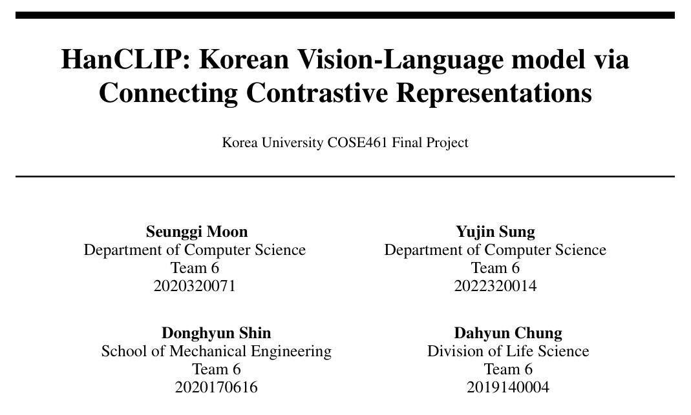](asset/Team6.pdf)

</br>프로젝트 관련 더 자세한 사항은 [AIKU 노션](https://aiku.notion.site/HanCLIP-215a7930e09c8092a975d6c37cb7eb7a?source=copy_link)에서 확인하실 수 있습니다.


## 방법론

HanCLIP은 이미지–한국어 간 직접적인 정렬 없이, **영어를 의미적 매개체(semantic pivot)**로 활용하여 이미지–한국어 표현 간 **공유 임베딩 공간(shared embedding space)**을 학습하는 구조를 지닙니다.

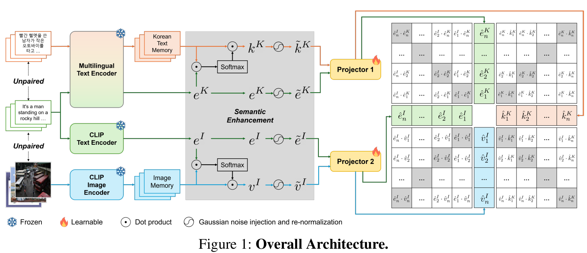

### Architecture Components

1. **Frozen Image Encoder**: CLIP ViT-B/32  
2. **Frozen Multilingual Text Encoder**: MiniLM-L12  
3. **Trainable Projection Heads**: f₁(·), f₂(·)

---

### Input 구성

- **영어 Text Query**: *eᵢ*
  - *eᵢᴵ*: CLIP Text Encoder로부터 추출된 영어 임베딩
  - *eᵢᴷ*: Multilingual Text Encoder로부터 추출된 영어 임베딩

- **이미지 메모리**: *V = {v₁, ..., vₙ}*  
  - CLIP Image Encoder로 전처리된 이미지 임베딩

- **한국어 텍스트 메모리**: *K = {k₁, ..., kₘ}*  
  - Multilingual Encoder로 전처리된 한국어 임베딩

---

### Semantic Enhancement

- 이미지 쿼리 및 한국어 쿼리로부터 **pseudo image** *vᵢᴵ*, **pseudo Korean text** *kᵢᴷ* 생성  
- Softmax-weighted aggregation으로 유사한 메모리에서 표현 보완
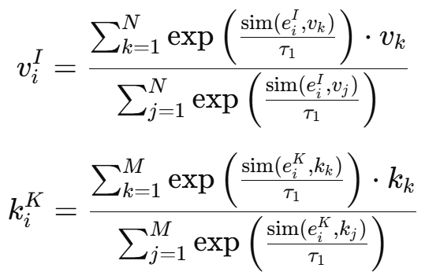

- 각 임베딩에 **노이즈 추가 및 L2 정규화** 수행:
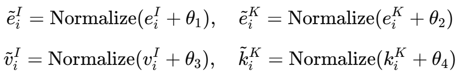

---

### Inter-alignment Loss

- 4가지 임베딩을 각각 projection head에 통과:
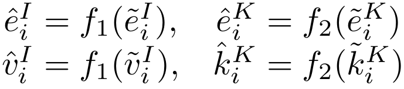

- 두 쌍 (image-text)의 **symmetric contrastive loss** 적용
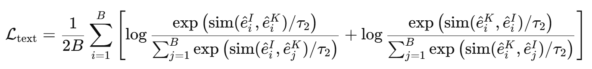  
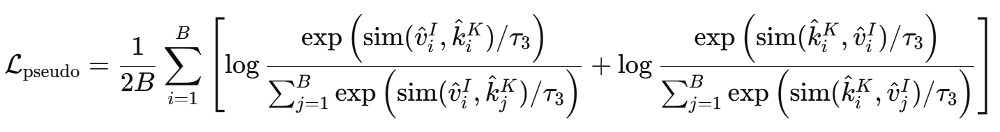

- 최종 Inter-alignment Loss

```
𝓛 = 𝓛_text + 𝓛_pseudo
```
---

### Intra-alignment Loss

- **모달리티 간 격차(modality gap)**를 줄이기 위해 attractive term만 사용  
- 동일 의미의 쌍 간 거리 최소화
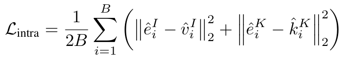

---

### Total Loss

```
𝓛 = 𝓛_inter + λ × 𝓛_intra
```

---

### Training Details

- 모든 인코더는 **Frozen**
- **Projection Head**만 학습
- 학습 시 Gaussian noise + normalization → generalization 및 표현력 향상

---


## 환경 설정
environment를 생성하고 아래 코드를 실행하여 dependency들을 설치

  ```
    conda create -n env_name python=3.9
    conda activate env_name
    pip install -r requirements.txt
  ```

## 사용 방법
### 1. Quantitative retrieval result (Recall@K)
  ```
    # MSCOCO-Korean 데이터셋에 대한 retrieval result
    python retrieval_quan_cc3m.py

    # KoCC3M 데이터셋에 대한 retrieval result
    python retrieval_quan_mscoco.py
  ```
  - 실행 시 hanclip, multilingual_clip, koclip에 대한 결과 metric 표시

### 2. Quantitative classification result (F1 score)
  ```
    sh classification.sh
  ```
  - 위 파일에서 --dataset을 cifar10, stl10, caltech101, cifar100 으로 바꿔서 실행
  - 위 파일에서 --model을 hanclip, multilingual_clip, koclip 으로 바꿔서 실행

### 3. Qualitative retrieval result
  ```
    python retrieval_img.py
  ```
  - 위 파일에서 query_text를 원하는 문장으로 수정가능
  - 해당 query_text에 대한 top10 이미지 retrieval 결과가 {idx}_{query_text}.png 형식으로 저장됨

### 4. Inference time 
  ```
    python inference_time.py
  ```

### 5. Visualization of cosine simalarity
  ```
    python visualization_cossim.py
  ```
  - 실행 시 hanclip, multilingual_clip, koclip에 대한 결과가 각각 cosine_similarity_{model_name}.png 로 저장됨

### 6. Visualization of image embedding
  ```
    python visualization_imgemb.py
  ```
  - 실행 시 hanclip, clip, koclip에 대한 결과가 각각 cifar10_umap_{model_name}.png 로 저장됨

## 예시 결과
### 1. Quantitative retrieval result (Recall@K)
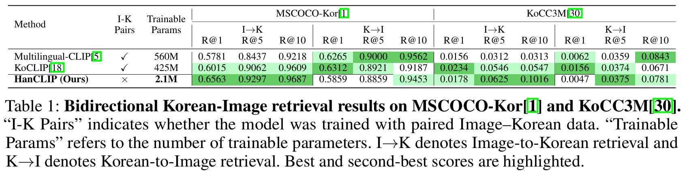

### 2. Quantitative classification result (F1 score)
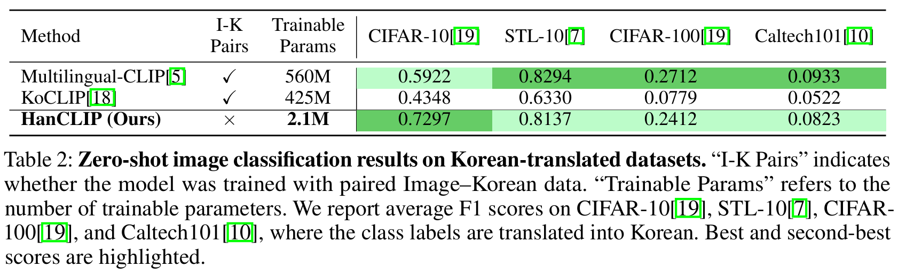

### 3. Qualitative retrieval result
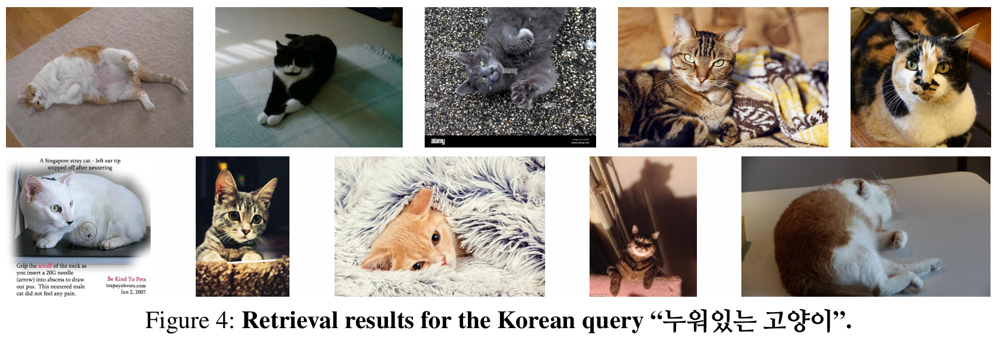

### 4. Inference time 
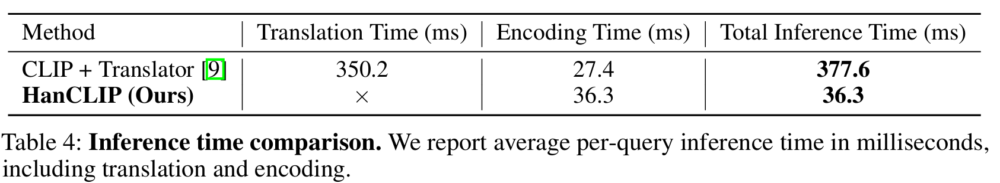

### 5. Visualization of cosine simalarity
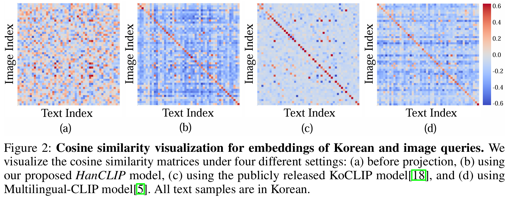

### 6. Visualization of image embedding
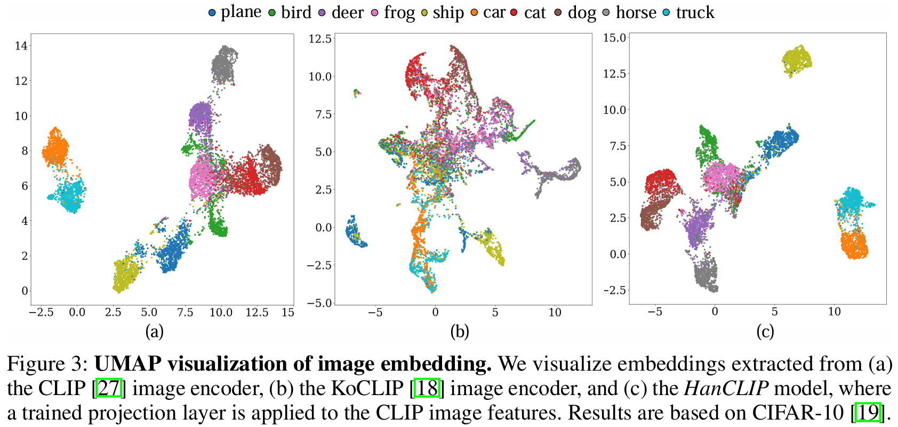

## 팀원

  | 팀원                            | 역할                                       |
| ----------------------------- | ---------------------------------------- |
| [문승기](https://github.com/moon44432) |    Dataset curation, Architecture figure, Evaluation   |
| [성유진](https://github.com/dinyudin203)      |    Dataset curation, Train, Evaluation    |
| [신동현](https://github.com/Donghyun1228)     |    Dataset curation, Train(Overall), Evaluation    |
| [정다현](https://github.com/dhyun22)        |    Dataset curation, Paper writing, Analysis    |
